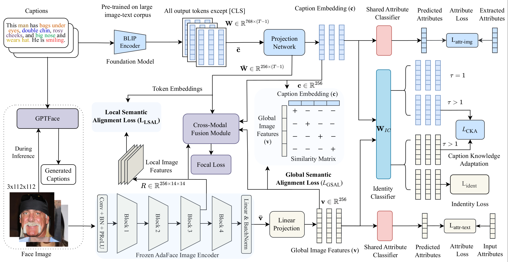

# CaptionFace: Learning Multi-Scale Knowledge-Guided Features for Text-Guided Face Recognition

[]()
[]()
[]()
[]()
[]()

### **IEEE Transactions on Biometrics, Behavior, and Identity Science (TBIOM), Vol. 7, No. 2, pp. 195–209, April 2025**

[Md Mahedi Hasan](https://github.com/Mahedi-61), Shoaib Meraj Sami, Nasser M. Nasrabadi, Jeremy Dawson

Lane Department of Computer Science and Electrical Engineering, West Virginia University

📄 [Paper (IEEE Xplore, DOI: 10.1109/TBIOM.2024.3466216)](https://doi.org/10.1109/TBIOM.2024.3466216) · 📝 [Citation](#citation)  

---

## Overview

CaptionFace is a text-guided face recognition (TGFR) framework that uses natural-language facial descriptions as auxiliary supervision to improve the robustness of state-of-the-art face recognition (FR) models, particularly under low-resolution, sensor-noise, and atmospheric-turbulence conditions common in surveillance scenarios. It extends our earlier WACV 2024 work, [TGFR](https://github.com/Mahedi-61/Text_Guided_Face_Recognition), with a deeper alignment module, a knowledge-distillation mechanism between modalities, an attribute-aware objective, and an end-to-end captioning model that removes the framework's dependence on having a caption available at inference time.

The framework is built around four components:

- **GPTFace**, a lightweight face-captioning model (AdaFace image encoder + GPT-2 decoder) that generates a natural-language description directly from a low-resolution face image, so CaptionFace can be applied to single-modal FR datasets that have no associated text.
- **Multi-Scale Alignment Module (MSAM)**, which aligns image and caption embeddings at both the global level (global semantic alignment loss) and the local, region-to-token level (local semantic alignment loss).
- **Caption Knowledge Adaptation (CKA)**, a distillation mechanism that enriches the caption embedding with image-specific detail it might be missing, instead of forcing an identity loss directly onto noisy text features.
- **Cross-Modal Fusion Module (CMFM)**, a transformer block with multi-head cross- and self-attention that fuses local image features with caption token embeddings for the final identity decision.

CaptionFace is evaluated on three face-caption datasets (Multi-Modal CelebA-HQ, Face2Text, CelebA-Dialog), on single-modal benchmark FR datasets (LFW, CALFW, AgeDB-30) using captions generated on the fly by GPTFace, and on a fine-grained image classification benchmark (CUB-200-2011) to show the alignment module generalizes beyond faces.

## Highlights

- Removes TGFR's dependence on having ground-truth captions at inference time via GPTFace.
- Local + global contrastive alignment (MSAM) instead of a single coarse image-text contrastive loss.
- Caption Knowledge Adaptation distills image-specific detail into text embeddings without polluting them with a direct identity loss.
- Attribute-aware loss adds a modality-invariant, fine-grained supervisory signal on top of identity loss.
- Consistently outperforms ArcFace, AdaFace, MagFace, and our own TGFR (WACV 2024) baseline across three face-caption datasets, three FR benchmarks.
- GPTFace matches BLIP/BLIP-2 captioning quality at roughly one-third the input resolution and a fraction of the parameter count (177M vs. 446M/1.1B).

## Architecture

<p align="center">
  
</p>

The frozen AdaFace backbone provides global (`v`) and local (`R`) image features; BLIP provides contextualized caption token embeddings (`W`), projected by a 1D-CNN projection network into the shared 256-d space. MSAM trains this projection with a global semantic alignment loss (GSAL) and a local semantic alignment loss (LSAL). A shared identity classifier (`W_IC`) supervises the image branch directly and the text branch indirectly through CKA (KL distillation from the image's class probabilities at a higher temperature). An attribute-aware loss is applied on both modalities using a 40-attribute vector extracted from the caption with TextBlob. The CMFM transformer fuses local image features and caption tokens via cross-attention, then self-attention, and is trained with a focal loss.

### GPTFace: face image captioning
GPTFace pairs the frozen AdaFace encoder with a 12-block GPT-2 decoder. A projection network combines AdaFace's local and global features (with a self-attention layer to capture long-range dependencies) into the encoder context that a cross-attention scheme injects into every GPT-2 block, since GPT-2 has no native mechanism for consuming encoder features. GPTFace is trained with a language-modeling loss plus a multi-label classification loss (`L_attr-text`) that penalizes attributes the decoder gets wrong or omits, as judged against attributes extracted from the ground-truth caption.

## Repository Structure

```
CaptionFace/
├── cfg/                          # YAML / Python configs and hyperparameter search space
│   ├── config_space.py           # Dataset configs, pretrained-weight paths, BLIP/BERT model IDs
│   ├── fgic.yml                  # Fine-grained image classification (CUB) config
│   ├── test.yml                  # Single-run test config
├── data/                         # Dataset root (not version-controlled, see Datasets below)
├── fgic/                         # Fine-grained image classification on CUB-200-2011
│   ├── dataset.py
│   ├── fgic_models.py
│   ├── train_fgic_captionface.py # CaptionFace alignment module applied to CUB
├── models/                       # Network and loss definitions
│   ├── attention.py
│   ├── fc_iresnet.py / iresnet.py    # iResNet18/50/101 backbones
│   ├── fc_model.py                   # GPTFace (VisionGPT2Model)
│   ├── fusion_nets.py                # LinearFusion, FCFM, CMF, CMF_FR (CMFM)
│   ├── metrics.py                    # ArcFace / AdaFace / MagFace margin heads
│   ├── models.py                     # TextEncoder, ProjectionHead, IMIM
├── src/                           # Main training / evaluation entry points
│   ├── train_captionface.py       # Train CaptionFace (MSAM + CKA + attribute loss + CMFM)
│   ├── test_captionface.py        # 1:1 verification on face-caption test splits
│   ├── eval_lfw_calfw_agedb.py    # Benchmark FR evaluation (Table III)
│   ├── gptface_main.py            # Train / test GPTFace, generate captions
├── utils/                         # Dataloaders, attribute extraction, helper utilities
│   ├── attribute.py / attribute_cap.py   # 40-attribute vector extraction (TextBlob)
│   ├── dataset_utils.py / prepare.py / modules.py
│   ├── train_dataset.py / test_dataset.py
│   └── vis_distribution.py        # Cosine-similarity distribution plot (Fig. 11)
├── visualize/                     # Grad-CAM++ visualization (Figs. 8 and 9)
│   ├── code.py
├── weights/                       # Pretrained / fine-tuned checkpoints (not version-controlled)
│   ├── pretrained/                # AdaFace / ArcFace / MagFace iResNet backbones
│   ├── finetuned/                 # Image encoders fine-tuned in the ablation study
│   ├── face_caption/              # GPTFace checkpoints
└── requirements.txt
```

## Installation

```bash
git clone https://github.com/Mahedi-61/CaptionFace.git
cd CaptionFace

conda create -n captionface python=3.9
conda activate captionface

# install PyTorch matching your CUDA version, e.g.
pip install torch torchvision --index-url https://download.pytorch.org/whl/cu118

pip install -r requirements.txt
```


## Datasets

| Dataset | Images | Identities | Captions / image | Notes |
|---|---|---|---|---|
| [Multi-Modal CelebA-HQ](https://github.com/weihaox/Multi-Modal-CelebA-HQ-Dataset) | 30,000 | 6,217 | 10 | 40 facial attributes, sourced from CelebA-HQ |
| [Face2Text v2.0](https://github.com/mtanti/face2text-dataset) | 10,559 | 6,193 (5,000 train / 1,193 test) | 1–5 | Manually annotated, free-form captions |
| [CelebA-Dialog](https://github.com/yumingj/Talk-to-Edit) | 202,599+ | 10,177 (8,000 train / 2,177 test) | 1 | 5 fine-grained attributes: bangs, eyeglasses, beard, smiling, age |
| [CUB-200-2011](https://www.vision.caltech.edu/datasets/cub_200_2011/) | 11,788 (5,994 train / 5,794 test) | 200 bird classes | 10 | Used for fine-grained image classification, not FR |
| [LFW](http://vis-www.cs.umass.edu/lfw/) / [CALFW](https://arxiv.org/abs/1708.08197) / [AgeDB-30](https://ibug.doc.ic.ac.uk/resources/agedb/) | standard splits | – | generated by GPTFace | Single-modal FR benchmarks, no ground-truth captions |

Download each dataset from its original source and place it under `data/<name>/images/`, matching the layout the loaders expect, e.g.:

```
data/celeba/images/train_ver.txt
data/celeba/images/test_ver.txt
data/celeba/images/valid_ver.txt
```

`cfg/config_space.py` already defines the per-dataset paths, number of identities, and token lengths used in the paper (`celeba_cfg`, `face2text_cfg`, `celeba_dialog_cfg`, `LFW_cfg`, `CALFW_cfg`, `AGEDB_cfg`) — edit these if your local layout differs.

## Pretrained Weights

Place backbone checkpoints under `weights/pretrained/`, named to match `cfg/config_space.py`:

| Backbone | iResNet18 | iResNet50 | iResNet101 |
|---|---|---|---|
| AdaFace | `adaface_ir18_webface4m.ckpt` | `adaface_ir50_ms1mv2.ckpt` | `adaface_ir101_ms1mv2.ckpt` |
| ArcFace | `arcface_ir18_ms1mv3.pth` | `arcface_ir50_ms1mv3.pth` | `arcface_ir101_ms1mv3.pth` |
| MagFace | – | `magface_ir50_ms1mv2.pth` | `magface_ir101_ms1mv2.pth` |

All three backbones are pre-trained on MS1MV2/WebFace4M-scale face datasets and kept **frozen** during CaptionFace training (Section IV.A.3 of the paper), except in the fine-tuning ablation (`finetune_image_encoder.py`), whose output checkpoints are expected under `weights/finetuned/`. GPTFace checkpoints are saved to `weights/face_caption/`, and CUB-200-2011 checkpoints to `weights/fgic/`.

## Training

All commands assume they are run from the repository root.

### 1. Train CaptionFace

```bash
python3 src/train_captionface.py \
    --dataset celeba \
    --model_type adaface \
    --fusion_type CMF_FR \
    --batch_size 8 \
    --max_epoch 18 \
    --is_itc --is_KD --is_attr_loss
```

- `--dataset`: `celeba` | `face2text` | `celeba_dialog`
- `--model_type`: `arcface` | `adaface`
- `--fusion_type`: `CMF_FR` (CMFM) | `linear`
- `--freeze`: number of epochs the BLIP text encoder stays frozen while MSAM/CMFM warm up (paper uses 6 of 18 epochs)
- `--is_itc`, `--is_KD`, `--is_attr_loss`, `--is_DAMSM`: toggle the global/local alignment, CKA, attribute-aware, and DAMSM losses respectively
- `--lambda_f`, `--lambda_attr`, `--lambda_kd`, `--lambda_id`, `--lambda_itc`, `--lambda_cmp`: loss weights (see Table X in the paper for the searched/optimal values)
- `--min_lr_bert`: learning rate for the BLIP encoder (paper: `3e-5`, AdamW, with linear warm-up)

Checkpoints are written to `checkpoints/<dataset>/CaptionFace/`.

### 2. Train GPTFace (face image captioning)

```bash
python3 src/gptface_main.py --train --arch adaface --dataset celeba --epochs 8 --batch_size 64
```

`--freeze_epochs` controls how long the image encoder and GPT-2 blocks stay frozen before full fine-tuning (paper: 3 of 8 epochs). Add `--attr_loss` to enable the attribute-aware captioning loss and `--sa` to enable the self-attention layer in the projection network (both ablated in Table IX).

### 3. Fine-grained image classification (CUB-200-2011)

```bash
# CaptionFace alignment module on CUB
python3 fgic/train_fgic_captionface.py --resnet_layer 18 --fusion_type CMF

# ResNet-only baseline
python3 fgic/train_fgic_resnet.py --dataset cub --resnet_layer 18 --epochs 36
```


### Legacy BERT-encoder baseline

`src/fusion_bert.py` reproduces the BERT-text-encoder + linear-fusion baseline (Baseline II in Table II) used as a point of comparison; configure it via `cfg/train_bert.yml` and run with `python3 src/fusion_bert.py --cfg cfg/train_bert.yml`.

## Evaluation

```bash
# 1:1 verification on a face-caption test set (Table II)
python3 src/test_captionface.py --model_type adaface --dataset celeba

# Same, using the standalone evaluator
python3 src/eval_celeba_face2text_dialog.py --model_type adaface --dataset celeba

# Benchmark FR evaluation: LFW / CALFW / AgeDB-30 (Table III)
python3 src/eval_lfw_calfw_agedb.py --architecture ir_101 --model_type adaface --dataset CALFW

# Generate captions and evaluate BLEU/METEOR/ROUGE-L (Table IV)
python3 src/gptface_main.py --test --generate --dataset AGEDB --arch adaface

# Fine-grained classification on CUB-200-2011 (Table V)
python3 fgic/train_fgic_captionface.py --test --resnet_layer 18 \
    --saved_model_file resnet18_cub.pth \
    --text_encoder text_res18_bert_CMF_17 --image_encoder image_res18_bert_CMF_17
```

Grad-CAM++ visualizations (Figs. 8–9) and the cosine-similarity distribution plot (Fig. 11) can be reproduced with `visualize/code_final.py` and `utils/vis_distribution.py` respectively.

## Results

### 1:1 verification rate (TPR % at FPR = 1e-6 / 1e-5 / 1e-4) on face-caption datasets

| Backbone | Method | MMCelebA 1e-6/1e-5/1e-4 | Face2Text 1e-6/1e-5/1e-4 | CelebA-Dialog 1e-6/1e-5/1e-4 |
|---|---|---|---|---|
| ArcFace | Baseline I (image only) | 36.31 / 49.47 / 55.71 | 43.33 / 46.10 / 52.14 | 21.58 / 59.09 / 66.46 |
| ArcFace | Baseline II (BERT + linear fusion) | 47.32 / 63.89 / 72.83 | 50.21 / 62.56 / 64.96 | 31.60 / 63.77 / 70.23 |
| ArcFace | CGFR | 51.20 / 66.32 / 78.05 | 51.50 / 63.50 / 65.92 | 34.89 / 64.90 / 74.83 |
| ArcFace | TGFR (WACV 2024) | 52.63 / 67.72 / 78.73 | 52.26 / 64.28 / 67.06 | 36.09 / 66.02 / 76.84 |
| ArcFace | **CaptionFace (ours)** | **54.45 / 68.52 / 79.78** | **53.36 / 65.29 / 67.81** | **37.09 / 66.48 / 78.90** |
| AdaFace | Baseline I (image only) | 36.21 / 56.78 / 70.75 | 52.78 / 54.65 / 57.90 | 28.26 / 59.39 / 68.67 |
| AdaFace | Baseline II (BERT + linear fusion) | 57.68 / 65.50 / 78.0 | 56.27 / 58.60 / 62.0 | 38.56 / 61.78 / 72.51 |
| AdaFace | CGFR | 60.20 / 65.80 / 81.0 | 57.76 / 61.60 / 65.0 | 41.90 / 63.36 / 74.88 |
| AdaFace | TGFR (WACV 2024) | 61.0 / 68.20 / 81.0 | 59.06 / 64.29 / 67.81 | 43.16 / 65.50 / 75.20 |
| AdaFace | **CaptionFace (ours)** | **62.56 / 69.38 / 81.0** | **60.85 / 65.29 / 68.89** | **44.50 / 67.06 / 76.67** |

### Verification accuracy (%) on LFW / CALFW / AgeDB-30

| Backend | Method | LFW | CALFW | AgeDB |
|---|---|---|---|---|
| iResNet50 | ArcFace | 99.80 | 95.40 | 98.08 |
| iResNet50 | MagFace | 99.82 | 95.98 | 98.0 |
| iResNet50 | AdaFace | 99.82 | 96.07 | 97.85 |
| iResNet50 | **Ours (ArcFace)** | 99.85 | 95.70 | **98.19** |
| iResNet50 | **Ours (MagFace)** | 99.85 | 96.07 | 98.14 |
| iResNet50 | **Ours (AdaFace)** | **99.86** | **96.13** | 98.02 |
| iResNet101 | ArcFace | 99.83 | 95.45 | 98.28 |
| iResNet101 | MagFace | 99.83 | 96.15 | 98.17 |
| iResNet101 | AdaFace | 99.82 | 96.08 | 98.05 |
| iResNet101 | **Ours (ArcFace)** | 99.86 | 95.61 | **98.35** |
| iResNet101 | **Ours (MagFace)** | 99.86 | **96.22** | 98.28 |
| iResNet101 | **Ours (AdaFace)** | **99.87** | 96.15 | 98.19 |

### GPTFace vs. multimodal foundation models on MMCelebA (captioning)

| Method | Visual backbone | Input size | B@1 | B@2 | B@3 | B@4 | METEOR | ROUGE-L |
|---|---|---|---|---|---|---|---|---|
| BLIP | ViT-B/16 | 384×384 | 76.84 | 66.54 | 54.13 | 44.56 | 60.41 | 60.68 |
| BLIP-2 | ViT-g FT5 | 384×384 | 84.56 | 73.85 | 66.0 | 57.36 | **61.94** | **61.12** |
| GPTFace (ours) | ArcFace, iResNet18 | 112×112 | 90.08 | 85.64 | 78.28 | 69.24 | 59.60 | 60.50 |
| GPTFace (ours) | AdaFace, iResNet18 | 112×112 | **91.10** | **86.0** | **78.96** | **69.90** | 59.80 | 60.74 |

GPTFace reaches this with 177M trainable parameters at less than one-third the input resolution of BLIP/BLIP-2 (446M and 1.1B parameters, respectively).

Full ablations over the objective function (Table VI), atmospheric-turbulence robustness (Table VII), image-encoder fine-tuning (Table VIII), GPTFace component-wise ablation (Table IX), and the hyperparameter search space (Table X) are in the paper.

## Citation

If you use this code or build on this work, please cite:

```bibtex
@ARTICLE{Hasan_captionface_2025,
  author={Hasan, Md Mahedi and Sami, Shoaib Meraj and Nasrabadi, Nasser M. and Dawson, Jeremy},
  journal={IEEE Transactions on Biometrics, Behavior, and Identity Science},
  title={Learning Multi-Scale Knowledge-Guided Features for Text-Guided Face Recognition},
  year={2025},
  volume={7},
  number={2},
  pages={195-209},
  doi={10.1109/TBIOM.2024.3466216}
}
```

This paper extends our two earlier works on text-guided face recognition:

```bibtex
@InProceedings{Hasan_TGFR_2024,
    author    = {Hasan, Md Mahedi and Sami, Shoaib Meraj and Nasrabadi, Nasser},
    title     = {Text-Guided Face Recognition Using Multi-Granularity Cross-Modal Contrastive Learning},
    booktitle = {Proceedings of the IEEE/CVF Winter Conference on Applications of Computer Vision (WACV)},
    month     = {January},
    year      = {2024},
    pages     = {5784-5793}
}

@InProceedings{Hasan_CGFR_2023,
    author={Hasan, Md Mahedi and Nasrabadi, Nasser},
    booktitle={2023 IEEE International Joint Conference on Biometrics (IJCB)},
    title={Improving Face Recognition from Caption Supervision with Multi-Granular Contextual Feature Aggregation},
    year={2023},
    pages={1-10}
}
```

## Acknowledgement

This work was supported by the Center for Identification Technology Research (CITeR) and the National Science Foundation under Grant 1650474. The image encoders build on [ArcFace](https://github.com/deepinsight/insightface), [AdaFace](https://github.com/mk-minchul/AdaFace), and [MagFace](https://github.com/IrvingMeng/MagFace); the text encoder builds on [BLIP](https://github.com/salesforce/BLIP); the captioning decoder builds on [GPT-2](https://github.com/openai/gpt-2).

## Related Works

- [TGFR (WACV 2024)](https://github.com/Mahedi-61/Text_Guided_Face_Recognition) — our earlier two-stage text-guided FR framework that this work extends to an end-to-end design.

## Contact

For questions, issues, or suggestions related to this repository, please open an issue on GitHub or contact [@Mahedi-61](https://github.com/Mahedi-61).
